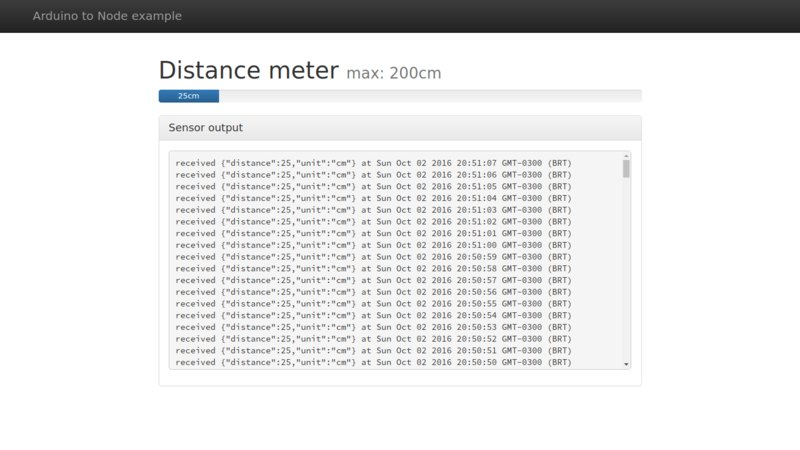
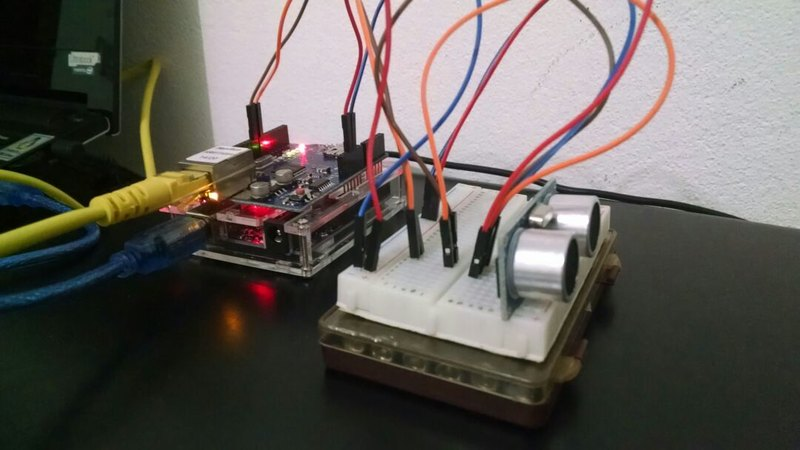

# arduino2node

A simple example on how to communicate Arduino to a Node.js server

# Requirements

## Arduino

- Arduino Uno
- Ethernet Shield
- Ultrasonic Sensor HC-SR04

## Web server

- Node.js

# Setup

## Arduino

- Assemble Arduino + Ethernet Shield
- Set Ultrasonic `Trig` to pin `7`
- Set Ultrasonic `Echo` to pin `8`
- Upload the Sketch in `arduino/distance/`
- Connect to PC through an ethernet cable

## Web server

- `cd nodejs`
- `npm install`
- Set your ip address to `192.168.0.100`
- `DEBUG=a2n* npm start`

Open [http://localhost:3000](http://localhost:3000)

